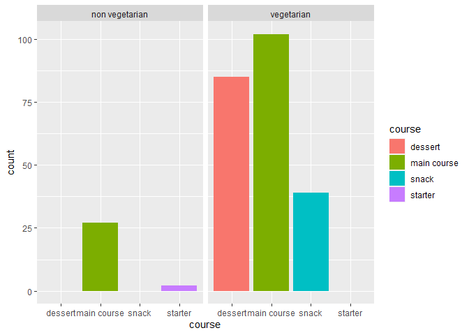
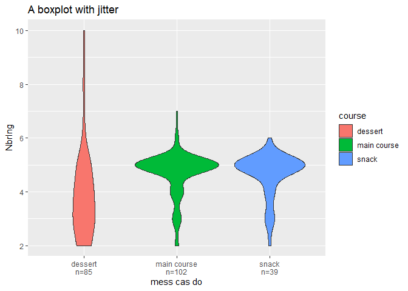
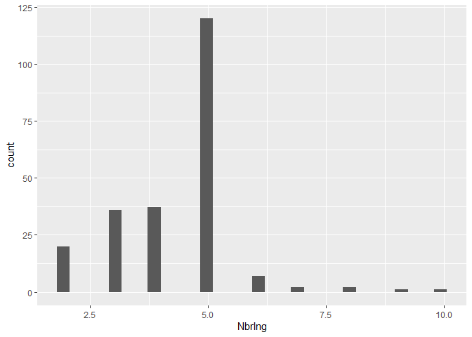
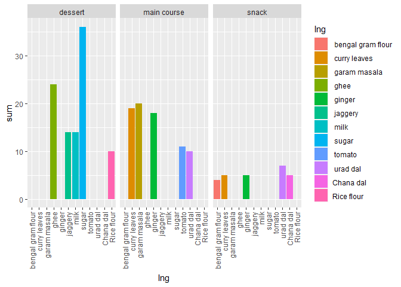

Come on
================
Didier Yourassoff
(08 décembre, 2022)

-   <a href="#introduction" id="toc-introduction">Introduction</a>
-   <a href="#lets-explore-the-data" id="toc-lets-explore-the-data">Let’s
    explore the data</a>
-   <a href="#questions-to-be-answer-et-hypothesis"
    id="toc-questions-to-be-answer-et-hypothesis">Questions to be answer et
    hypothesis</a>
    -   <a href="#hypothesis" id="toc-hypothesis">hypothesis</a>
        -   <a href="#here-i-select-the-data-i-need"
            id="toc-here-i-select-the-data-i-need">Here I select the data I need</a>
    -   <a href="#combien-dingrédient-par-plat"
        id="toc-combien-dingrédient-par-plat">Combien d’ingrédient par plat</a>
    -   <a href="#quel-ingrédients-est-le-plus-utilisé-en-de-manière-générale"
        id="toc-quel-ingrédients-est-le-plus-utilisé-en-de-manière-générale">Quel
        ingrédients est le plus utilisé en de manière générale</a>
-   <a href="#references" id="toc-references">References</a>

This report uses the [R programming
language](https://cran.r-project.org/doc/FAQ/R-FAQ.html) (R Core Team
2021) and the following [R libraries](https://r-pkgs.org/intro.html)
(Wickham et al. 2019; Xie 2021).

``` r
#Import libraries
library(tidyverse)
library(dplyr)
library(knitr)
library(ggplot2)
library("stringr")
```

------------------------------------------------------------------------

# Introduction

My friends like to describe me as a gourmet. I love to eat, to cook.
Food is an integral part of my life, as I am sure it is of yours. Life
made me discover Indian food a little more deeply at the beginning of
this year. I have been interested in it ever since. So much so that
while searching for data for my data practical, I came across a data set
listing lots of Indian dishes. Bingo! No need to continue the research.
I have my raw material for my work. The subject interests me and at the
same time I’m going to learn more about this spicy cuisine. Let’s go!

So I’m going to work with the [Indian Food
101](https://www.kaggle.com/datasets/nehaprabhavalkar/indian-food-101)
data set assembled by Neha Prabhavalkar. I have retrieved the data from
[Kaggle](www.https://www.kaggle.com/datasets), a site known for listing
a large number of datasets. According to the description provided with
the data set [Indian Food
101](https://www.kaggle.com/datasets/nehaprabhavalkar/indian-food-101),
it contains information about 255 traditional Indian dishes: including
the ingredients required to make them, the place of origin of the dishes
and many other elements. To learn more, let’s take a look at the data!

------------------------------------------------------------------------

# Let’s explore the data

First, I will import the data and display the first rows of the table.

``` r
#Import data from github repository
IndianFood_df <- read_csv(url("https://raw.githubusercontent.com/DidierYourassoff/IntroDataScience/main/indian_food.csv"))
#Display the first lines of the table
head(IndianFood_df) %>% kable()
```

| name           | ingredients                                                                                    | diet       | prep_time | cook_time | flavor_profile | course  | state       | region |
|:---------------|:-----------------------------------------------------------------------------------------------|:-----------|----------:|----------:|:---------------|:--------|:------------|:-------|
| Balu shahi     | Maida flour, yogurt, oil, sugar                                                                | vegetarian |        45 |        25 | sweet          | dessert | West Bengal | East   |
| Boondi         | Gram flour, ghee, sugar                                                                        | vegetarian |        80 |        30 | sweet          | dessert | Rajasthan   | West   |
| Gajar ka halwa | Carrots, milk, sugar, ghee, cashews, raisins                                                   | vegetarian |        15 |        60 | sweet          | dessert | Punjab      | North  |
| Ghevar         | Flour, ghee, kewra, milk, clarified butter, sugar, almonds, pistachio, saffron, green cardamom | vegetarian |        15 |        30 | sweet          | dessert | Rajasthan   | West   |
| Gulab jamun    | Milk powder, plain flour, baking powder, ghee, milk, sugar, water, rose water                  | vegetarian |        15 |        40 | sweet          | dessert | West Bengal | East   |
| Imarti         | Sugar syrup, lentil flour                                                                      | vegetarian |        10 |        50 | sweet          | dessert | West Bengal | East   |

From the first lines, and the names of the columns, I can already see
that I have a column for the name of each dish, one for the necessary
ingredients, one for the diet, one for the preparation time, one for the
cooking time, one for the course of meal, one for the flavor profile,
one for the state of origin and finally one for the region of origin of
each dish.

Also, as it stands, for the ingredients column, I see that there are
several ingredients listed in one cell, while the other columns contain
one piece of information per cell. For example, there is only one region
or preparation time for each dish. I will come back to this later.

Now let’s look at the last few rows of the table.

``` r
#Display the last lines of the table
tail(IndianFood_df) %>% kable()
```

| name      | ingredients                                                           | diet       | prep_time | cook_time | flavor_profile | course      | state           | region     |
|:----------|:----------------------------------------------------------------------|:-----------|----------:|----------:|:---------------|:------------|:----------------|:-----------|
| Shukto    | Green beans, bitter gourd, ridge gourd, banana, brinjal               | vegetarian |        10 |        20 | spicy          | main course | West Bengal     | East       |
| Til Pitha | Glutinous rice, black sesame seeds, gur                               | vegetarian |         5 |        30 | sweet          | dessert     | Assam           | North East |
| Bebinca   | Coconut milk, egg yolks, clarified butter, all purpose flour          | vegetarian |        20 |        60 | sweet          | dessert     | Goa             | West       |
| Shufta    | Cottage cheese, dry dates, dried rose petals, pistachio, badam        | vegetarian |        -1 |        -1 | sweet          | dessert     | Jammu & Kashmir | North      |
| Mawa Bati | Milk powder, dry fruits, arrowroot powder, all purpose flour          | vegetarian |        20 |        45 | sweet          | dessert     | Madhya Pradesh  | Central    |
| Pinaca    | Brown rice, fennel seeds, grated coconut, black pepper, ginger powder | vegetarian |        -1 |        -1 | sweet          | dessert     | Goa             | West       |

The last lines do not give much more information than the first lines. I
see, for example, concerning the flavor profile, a new value, “spicy”,
where I had only “sweet” in the first lines. Similarly, concerning the
course column, a new value “main course”, where I had only “dessert”.

However, when I look at these last lines, I discover cells with the
value (-1). According to the description provided with the data set,
this is a convention to notify cells that have no assigned values.
Preferring to work with NA’s, I will replace each value (-1) with a NA
in the data set.

Here is what the last rows of the table look like now.

``` r
#Replacing (-1) with NA
IndianFood_df <- na_if(IndianFood_df, -1)
#Display the last lines of the table
tail(IndianFood_df) %>% kable()
```

| name      | ingredients                                                           | diet       | prep_time | cook_time | flavor_profile | course      | state           | region     |
|:----------|:----------------------------------------------------------------------|:-----------|----------:|----------:|:---------------|:------------|:----------------|:-----------|
| Shukto    | Green beans, bitter gourd, ridge gourd, banana, brinjal               | vegetarian |        10 |        20 | spicy          | main course | West Bengal     | East       |
| Til Pitha | Glutinous rice, black sesame seeds, gur                               | vegetarian |         5 |        30 | sweet          | dessert     | Assam           | North East |
| Bebinca   | Coconut milk, egg yolks, clarified butter, all purpose flour          | vegetarian |        20 |        60 | sweet          | dessert     | Goa             | West       |
| Shufta    | Cottage cheese, dry dates, dried rose petals, pistachio, badam        | vegetarian |        NA |        NA | sweet          | dessert     | Jammu & Kashmir | North      |
| Mawa Bati | Milk powder, dry fruits, arrowroot powder, all purpose flour          | vegetarian |        20 |        45 | sweet          | dessert     | Madhya Pradesh  | Central    |
| Pinaca    | Brown rice, fennel seeds, grated coconut, black pepper, ginger powder | vegetarian |        NA |        NA | sweet          | dessert     | Goa             | West       |

Now let’s take a broader perspective by starting with the `str()`
function.

``` r
#Display the structure of the data set
str(IndianFood_df)
```

    ## spec_tbl_df [255 × 9] (S3: spec_tbl_df/tbl_df/tbl/data.frame)
    ##  $ name          : chr [1:255] "Balu shahi" "Boondi" "Gajar ka halwa" "Ghevar" ...
    ##  $ ingredients   : chr [1:255] "Maida flour, yogurt, oil, sugar" "Gram flour, ghee, sugar" "Carrots, milk, sugar, ghee, cashews, raisins" "Flour, ghee, kewra, milk, clarified butter, sugar, almonds, pistachio, saffron, green cardamom" ...
    ##  $ diet          : chr [1:255] "vegetarian" "vegetarian" "vegetarian" "vegetarian" ...
    ##  $ prep_time     : num [1:255] 45 80 15 15 15 10 10 10 20 10 ...
    ##  $ cook_time     : num [1:255] 25 30 60 30 40 50 50 20 30 40 ...
    ##  $ flavor_profile: chr [1:255] "sweet" "sweet" "sweet" "sweet" ...
    ##  $ course        : chr [1:255] "dessert" "dessert" "dessert" "dessert" ...
    ##  $ state         : chr [1:255] "West Bengal" "Rajasthan" "Punjab" "Rajasthan" ...
    ##  $ region        : chr [1:255] "East" "West" "North" "West" ...
    ##  - attr(*, "spec")=
    ##   .. cols(
    ##   ..   name = col_character(),
    ##   ..   ingredients = col_character(),
    ##   ..   diet = col_character(),
    ##   ..   prep_time = col_double(),
    ##   ..   cook_time = col_double(),
    ##   ..   flavor_profile = col_character(),
    ##   ..   course = col_character(),
    ##   ..   state = col_character(),
    ##   ..   region = col_character()
    ##   .. )
    ##  - attr(*, "problems")=<externalptr>

Here I see that the data set represents 255 rows and 9 columns. Among
the nine columns, there are two of type numeric (num) and seven of type
character (chr). Then, I can get a synthetic overview thanks to the
`summary()` function.

``` r
#Display a synthetic overview
summary(IndianFood_df)
```

    ##      name           ingredients            diet             prep_time     
    ##  Length:255         Length:255         Length:255         Min.   :  5.00  
    ##  Class :character   Class :character   Class :character   1st Qu.: 10.00  
    ##  Mode  :character   Mode  :character   Mode  :character   Median : 10.00  
    ##                                                           Mean   : 35.39  
    ##                                                           3rd Qu.: 20.00  
    ##                                                           Max.   :500.00  
    ##                                                           NA's   :30      
    ##    cook_time      flavor_profile        course             state          
    ##  Min.   :  2.00   Length:255         Length:255         Length:255        
    ##  1st Qu.: 20.00   Class :character   Class :character   Class :character  
    ##  Median : 30.00   Mode  :character   Mode  :character   Mode  :character  
    ##  Mean   : 38.91                                                           
    ##  3rd Qu.: 45.00                                                           
    ##  Max.   :720.00                                                           
    ##  NA's   :28                                                               
    ##     region         
    ##  Length:255        
    ##  Class :character  
    ##  Mode  :character  
    ##                    
    ##                    
    ##                    
    ## 

What do we have this time? I see several interesting pieces of
information for the prep_time and cook_time columns, namely the mean,
the median. Also for prep_time I have 30 NA’s, which means that the
preparation time is not filled in for 30 dishes; similarly, I have 28
NA’s for cook_time, which means that the cooking time is not filled in
for 28 dishes.

For the rest of the columns, I only retain one length information being
255 for all. This echoes the 255 rows that the table has as indicated by
the `str()` function above. That said, I can get more information from
the `str()` and `summary()` functions by turning the character columns
into factor’s. This is what I get.

Here is the structure with the type conversions of the columns.

``` r
#Convert character columns as factor
IndianFood_df <- IndianFood_df %>%
  mutate_if(is.character, as.factor)
#Display the structure of the data set
str(IndianFood_df)
```

    ## tibble [255 × 9] (S3: tbl_df/tbl/data.frame)
    ##  $ name          : Factor w/ 255 levels "Adhirasam","Aloo gobi",..: 14 28 72 77 81 88 89 97 99 112 ...
    ##  $ ingredients   : Factor w/ 252 levels "Aloo, tomatoes, mustard oil, bay leaf, cinnamon stick",..: 123 101 36 96 130 213 124 37 131 133 ...
    ##  $ diet          : Factor w/ 2 levels "non vegetarian",..: 2 2 2 2 2 2 2 2 2 2 ...
    ##  $ prep_time     : num [1:255] 45 80 15 15 15 10 10 10 20 10 ...
    ##  $ cook_time     : num [1:255] 25 30 60 30 40 50 50 20 30 40 ...
    ##  $ flavor_profile: Factor w/ 4 levels "bitter","sour",..: 4 4 4 4 4 4 4 4 4 4 ...
    ##  $ course        : Factor w/ 4 levels "dessert","main course",..: 1 1 1 1 1 1 1 1 1 1 ...
    ##  $ state         : Factor w/ 24 levels "Andhra Pradesh",..: 24 18 17 18 24 24 22 NA 24 NA ...
    ##  $ region        : Factor w/ 6 levels "Central","East",..: 2 6 3 6 2 2 3 NA 2 NA ...

And the output of the `summary()` function.

``` r
#Display a synthetic overview
summary(IndianFood_df)
```

    ##                 name    
    ##  Adhirasam        :  1  
    ##  Aloo gobi        :  1  
    ##  Aloo matar       :  1  
    ##  Aloo methi       :  1  
    ##  Aloo shimla mirch:  1  
    ##  Aloo tikki       :  1  
    ##  (Other)          :249  
    ##                                                                     ingredients 
    ##  Arbi ke patte, sesame seeds, gur, bengal gram flour, imli                :  2  
    ##  Chhena, sugar, ghee                                                      :  2  
    ##  Gram flour, ghee, sugar                                                  :  2  
    ##  Aloo, tomatoes, mustard oil, bay leaf, cinnamon stick                    :  1  
    ##  Aloo, urad dal, mustard, ginger, curry leaves                            :  1  
    ##  Amaranth leaves, split urad dal, mustard seeds, grated coconut, red chili:  1  
    ##  (Other)                                                                  :246  
    ##              diet       prep_time        cook_time      flavor_profile
    ##  non vegetarian: 29   Min.   :  5.00   Min.   :  2.00   bitter:  4    
    ##  vegetarian    :226   1st Qu.: 10.00   1st Qu.: 20.00   sour  :  1    
    ##                       Median : 10.00   Median : 30.00   spicy :133    
    ##                       Mean   : 35.39   Mean   : 38.91   sweet : 88    
    ##                       3rd Qu.: 20.00   3rd Qu.: 45.00   NA's  : 29    
    ##                       Max.   :500.00   Max.   :720.00                 
    ##                       NA's   :30       NA's   :28                     
    ##          course            state           region  
    ##  dessert    : 85   Gujarat    :35   Central   : 3  
    ##  main course:129   Punjab     :32   East      :31  
    ##  snack      : 39   Maharashtra:30   North     :49  
    ##  starter    :  2   West Bengal:24   North East:25  
    ##                    Assam      :21   South     :59  
    ##                    (Other)    :89   West      :74  
    ##                    NA's       :24   NA's      :14

I will consider one column after another. First, using the `str()`
function, I see that the name column contains “255 levels”, which means
that there are 255 unique names, or one name for each dish. This
corroborates the description of the data set given in the introduction.

Similarly, the function `str()` indicates that the ingredients column
contains “252 levels”, which means that there are 252 combinations of
ingredients. And since there are 255 dishes referenced for 252
ingredient combinations, this means that some dishes have the same
ingredient combination. I can verify this by looking at the output of
the `summary()` function, which indeed shows two occurrences for each of
the following combinations:

*“Arbi ke patte, sesame seeds, gur, bengal gram flour, imli” *”Chhena,
sugar, ghee” \*“Gram flour, ghee, sugar”.

Then, for the diet column, I note from the `str()` function that there
are “2 levels”. And the output of the `summary()` function explains the
two types of meals they refer to, namely “non-vegetarian” and
“vegetarian”.

I won’t dwell on the prep_time and cook_time columns here, since they
were not affected by the column type conversion.

For the flavor profile, the `str()` function displays “4 levels”, which
I find in the output of `summary()`, namely “bitter”, “sour”, “spicy”,
“sweet”. I also note that there are 28 NA’s, which means that 28 dishes
have no value assigned for the flavor profile.

Then, for the course column, the `str()` function returns “4 levels”,
and `summary()` describes “dessert”, “main course”, “snack”, “starter”.

For the state column, the `str()` function returns “24 levels”. That is,
24 different states. On the other hand, the `summary()` function makes
explicit only the five largest states in terms of number of associated
dishes; the others appear as “(Other)” in addition to the NA’s. Still,
24 is a possible and consistent number given that India has 29 states
and seven union territories (Dandona et al. 2017).

Finally, for the original region column, I get from the `str()` function
“6 levels”, which are summarized by the `summary()` function as follows:
“Central”, “East”, “North”, “North East”, “South”, “West”, and NA’s.

Que faire maintenant avec toute ses données que nous venons d’explorer?
C’est l’objet de la section suivant

# Questions to be answer et hypothesis

À partir de ce jeux de donnée, je me demande si le fait d’être un
dessert plutôt qu’un main course ou encore un snack a un une influence
sur les ingrédients utilisés, et aussi sur combien d’ingrédients sont
utilisés.

No need to do prediction here, cf. la leçon 7 sur github de Moran

## hypothesis

H0 : le course of meal du plat n’a aucune impact sur le … (nbr
ingrédient, ingrédients utilisés)

HA : le course of meal du plat a un impact sur le NOMBRE ingrédient,
QUELS SONT LES ingrédients utilisés,

### Here I select the data I need

Afin de répondre à mon hypothèse, l’ensemble des données du data set
n’est pas forcément pertinente. En effet considérons le graphique
ci-dessus.

``` r
IndianFood_df %>%
  ggplot(aes(x = course, fill=course)) + 
  geom_bar()  +
  facet_wrap(~ diet)
```

<!-- --> Sur ce
graphique, j’affiche, à partir de tout le data set, le nombre de plat
étant qualifiés en fonction de leur statut de dessert, main course,
snack, ou starter. De plus, l’ensemble des plats est séparés entre selon
le fait d’être végétarian ou non. Ce que je vois toute de suite, c’est
qu’il y a une grande majorité de plat végétarian. Je propose de nous
concentrer uniquement sur ces plats là pour la suite. À noter qu’il n’y
a pas de starter végétarian, c’est à dire que je vais travailler avec le
course of meal comme étant un factor à trois niveau ducoup. Je
supprimerais le niveau de starter au moment de la sélection des données,
et je supprimerais également les niveau de factor nul liés à la colonne
ingredients et name.

Je vais conserver la colone liées au nom et au ingrédients, car elles
permette respectivement d’identifier les observations et les ingrédients
sont un éléments central de mon investigations.

La colonne diet n’est plus pertinente étant donnée que je vais
travailler unqieument avec des repas végétariens.

Je ne vais pas conserver les prep_time et cook_time, ni la colonne liées
aux indications géographiques de régions et d’état. Il s’agit de faire
un choix cohérent par rapport à l’hypothèse que je me donne.

Voici ce que ça implique au niveau du code.

``` r
#selection des données 
Selectedfood <- IndianFood_df %>%
  #filter vegetarian meal
  filter(diet=="vegetarian") %>%
  #select les colonnes qui nous intéressent 
  select(name, course, ingredients)
#Removing unused factor level in the data set 
Selectedfood <- droplevels.data.frame(Selectedfood)
```

Et la nouvelle structure.

``` r
#Display the structure of the data set
str(Selectedfood)
```

    ## tibble [226 × 3] (S3: tbl_df/tbl/data.frame)
    ##  $ name       : Factor w/ 226 levels "Adhirasam","Aloo gobi",..: 13 22 59 63 67 73 74 81 83 96 ...
    ##  $ course     : Factor w/ 3 levels "dessert","main course",..: 1 1 1 1 1 1 1 1 1 1 ...
    ##  $ ingredients: Factor w/ 223 levels "Aloo, urad dal, mustard, ginger, curry leaves",..: 102 82 30 78 108 184 103 31 109 111 ...

Il nous reste donc pour travailler 226 recettes comme l’indique les “226
levels” de la colonne name en sortie de la fonction ´str()´. Revenons à
l’hypothèse. Celle-ci se divise en deux parties. Je vais commencer à
traiter de la première partie, liée au nombre d’ingrédient des recettes.

## Combien d’ingrédient par plat

ça ne vous aura pas échappé vous qui lisez ce rapport, en l’état
actuelle nous n’avons pas de colonne qui renseigne de manière directe le
nombre d’ingrédient pour chaque recette. Cela dit, comme mentionnée plus
haut, la colonne des ingrédients rassemble l’ensemble des ingrédients de
chaque recette dans une même cellule. Et, si on regarde bien, on peut
voir que chaque ingrédient dans une même cellule.

Ainsi, si je réussi à compter pour chaque recette le nombre de virgule
présent dans la cellule des ingrédients, je peux en déduire le nombre
d’ingrédient qu’elle compte: il s’agit d’une nombre de virgule en plus
d’une unité étant qu’une virgule sépare deux ingrédients. Allons-y!

``` r
NbrIngPerDish <- Selectedfood %>%
  #create a new colun called NbrIng et calculate how many ingredients
  mutate(Selectedfood, NbrIng = (str_count(ingredients, ",")+1))
```

Voici les premières lignes, soit les recettes comptant le plus
d’ingrédients en haut

``` r
  NbrIngPerDish%>%
  #put celui qui a le plus grand nombre tout en haut du tableau
  arrange(desc(NbrIng)) %>%
  head()%>%
  kable()
```

| name           | course      | ingredients                                                                                    | NbrIng |
|:---------------|:------------|:-----------------------------------------------------------------------------------------------|-------:|
| Ghevar         | dessert     | Flour, ghee, kewra, milk, clarified butter, sugar, almonds, pistachio, saffron, green cardamom |     10 |
| Jalebi         | dessert     | Maida, corn flour, baking soda, vinegar, curd, water, turmeric, saffron, cardamom              |      9 |
| Gulab jamun    | dessert     | Milk powder, plain flour, baking powder, ghee, milk, sugar, water, rose water                  |      8 |
| Mysore pak     | dessert     | Besan flour, semolina, mung bean, jaggery, coconut, skimmed milk powder, sugar, ghee           |      8 |
| Bandar laddu   | dessert     | Besan, jaggery, cardamom powder, ghee, cashews and raisins, jaggery syrup, sugar               |      7 |
| Obbattu holige | main course | Maida flour, turmeric, coconut, chickpeas, jaggery, ghee, cardamom                             |      7 |

Je note ici que le nombre maximum d’ingrédient pour une recette est de
10 et c’est un dessert. Appelons maintenant la fonction `summary()` pour
plus de détails.

``` r
summary(NbrIngPerDish)
```

    ##                 name             course   
    ##  Adhirasam        :  1   dessert    : 85  
    ##  Aloo gobi        :  1   main course:102  
    ##  Aloo matar       :  1   snack      : 39  
    ##  Aloo methi       :  1                    
    ##  Aloo shimla mirch:  1                    
    ##  Aloo tikki       :  1                    
    ##  (Other)          :220                    
    ##                                                                     ingredients 
    ##  Arbi ke patte, sesame seeds, gur, bengal gram flour, imli                :  2  
    ##  Chhena, sugar, ghee                                                      :  2  
    ##  Gram flour, ghee, sugar                                                  :  2  
    ##  Aloo, urad dal, mustard, ginger, curry leaves                            :  1  
    ##  Amaranth leaves, split urad dal, mustard seeds, grated coconut, red chili:  1  
    ##  Apricots, sugar syrup                                                    :  1  
    ##  (Other)                                                                  :217  
    ##      NbrIng      
    ##  Min.   : 2.000  
    ##  1st Qu.: 4.000  
    ##  Median : 5.000  
    ##  Mean   : 4.367  
    ##  3rd Qu.: 5.000  
    ##  Max.   :10.000  
    ## 

La sortie de la fonction `summary()` me donnent accès au nombre de
recette en fonction de course of meal d’une part. en chiffre, 39
recettes de snacks, 85 dessert et 102 main course. Notons que nous
avions déjà 85 dessert dans l’ensemble du data set au tout début. En
effet, psa de dessert à la viande car nous travaillons dans cette partie
qu’avec les recette végétarienne et nous avons le même nombre de
dessert. m’me chose pour les snacks, pas de sncak non végétarien. et
c’est immédiat à vérifier si on regarde le premier grapihque qui
affichait végé d’un côté et pas végé de l’autre un peu plus haut.

Maintenant on veut voir si, les dessert demandent en général plus
d’ingrédient que les mains course ou peut être que les snacks. Voici un
graphique.

``` r
# ça, ce qui a en dessous à adapter pour pouvoir  ajouter la sample size sous le violon et comme ça on peut se rendre compte de la différence dans la taille des échantillons. Je dois aussi faire le test statistique et c'est pas mal ensuite. 
# sample size
sample_size = NbrIngPerDish %>%
  group_by(course) %>%
  summarise(num=n())

# Plot
NbrIngPerDish %>%
  left_join(sample_size) %>%
  mutate(myaxis = paste0(course, "\n", "n=", num)) %>%
  ggplot(aes(x=myaxis, y=NbrIng, fill=course)) +
    geom_violin() +
    ggtitle("A boxplot with jitter") +
    xlab("mess cas do")
```

<!-- -->

Boxplot hides the sample size of each group, show it with annotation or
box width. J’ai fait ça.

Selon la première partie de l’hypothèse H0, le fait d’être un dessert ou
un main course ou un snack n’a pas d’impact sur le nombre d’ingrédient à
utiliser. À partir du graphique ci-dessus, j’observe que les main course
et les snack ont en majorité 5 aliments là où s’il s’agit de dessert, ce
serait un peu moins 4.

Faisons un peu de statistique pour savoir ce qu’il en est

qu’est-ce que j’ai moi dans ce cas en réalité: 2 types of variables

1 Independent var (predictor) categorical nominal 1 Dependent var
(outcome) quantitative discret

ASSUMPTIONS POUR ANOVA independence of observation =\> yes

Homogeneity of variance ==\> ? je veux voir si je trouve quelque chose
pour ça, sinon je fais Kruskal-Wallis Of these tests, the most common
assessment for homogeneity of variance is Levene’s test. The Levene’s
test uses an F-test to test the null hypothesis that the variance is
equal across groups. A p value less than .05 indicates a violation of
the assumption. If a violation occurs, it is likely that conducting the
non-parametric equivalent of the analysis is more appropriate. Levene’s
Test for Homogeneity of Variance (center = median) Df F value Pr(\>F)  
group 2 18.762 2.944e-08 \*\*\* 223

ducoup c’est baisé, on fait le kruskal-Wallis

``` r
#leveneTest(NbrIng ~ course, data = NbrIngPerDish)
library(car)
Test_homogenvar = leveneTest(NbrIng ~ course, data = NbrIngPerDish)
Test_homogenvar
```

    ## Levene's Test for Homogeneity of Variance (center = median)
    ##        Df F value    Pr(>F)    
    ## group   2  18.762 2.944e-08 ***
    ##       223                      
    ## ---
    ## Signif. codes:  0 '***' 0.001 '**' 0.01 '*' 0.05 '.' 0.1 ' ' 1

Normality of data, quand tu vois le graph en dessous, les données n’ont
pas l’air distribuée normallement, mais en même temps le sample est plus
de 30, donc je pourrais quand même y aller. ==\> mouais

``` r
NbrIngPerDish %>%
  ggplot(aes(x=NbrIng)) +
  geom_histogram()
```

<!-- --> ducoup
c’est mort pour l’anova à cause de la violation de la normality
distribution(même si sample size est grand), et violation de homogeneiti
of variance (test de levene) tout ça veut dire qu’on va ==\> Krus

``` r
kruskal.test(NbrIng ~ course, data = NbrIngPerDish)
```

    ## 
    ##  Kruskal-Wallis rank sum test
    ## 
    ## data:  NbrIng by course
    ## Kruskal-Wallis chi-squared = 39.801, df = 2, p-value = 2.277e-09

We can then say there are significant differences between the treatment
groups, being the course, dessert, snack, and the number of
ingredient(p-value \< 0.001).

Nous pouvons ainsi rejeter l’hypotèse h0 pour la première partie ce qui
signifie que le fait d’être main course, desserto ou snack a un impact
sur le nombre d’ingrédient en moyenne.

ANOVA is used when you want to find out if there are differences between
several groups. Assumptions of this test: Population distribution is
normal Samples are random and independent Homogeneity of sample variance

Qu’en est-il de la deuxième partie? Est-ce que il y a des ingrédients
différents utilisés en fonction des main course, dessert ou snack ?

## Quel ingrédients est le plus utilisé en de manière générale

(si ça marche, facetting suivant les courses, ou alors juste à la main
faire trois sous tableau)

pour tarvaillé sur les ingrédients utilisé en général, il nous faut
rendre tidy la cellue des ingrédients. C’est à dire travaillé sur les
données pour obtenir une information par cellule uniquement. Or nous
savons qu’il y a au maximum 10 ingrédient par recette. Donc la première
étape est de séparer la colonne des ingrédients, et de l’étaler sur 10
colonnes si on veut. Pour se faire je dois utiliser la fonction
´separate()´qui demande un vecteur pour nommer les nouvelles collones
qui vont apparaître.

``` r
#working on ingredient seperatly
#To separate ingredients column
NewColNames <- c("ing1","ing2","ing3","ing4","ing5","ing6","ing7","ing8","ing9","ing10")
NbrDishwtIng_wide <- NbrIngPerDish %>%
  #Separe ingredient colum
  separate(ingredients, NewColNames, sep=",")
```

là je dois déterminer demain ce que j’affiche en terme de structure, je
pense j’affiche la structure et la head. Mais peut être que je met la
head avant. Voir comment j’ai fait plus haut.

``` r
str(NbrDishwtIng_wide)
```

    ## tibble [226 × 13] (S3: tbl_df/tbl/data.frame)
    ##  $ name  : Factor w/ 226 levels "Adhirasam","Aloo gobi",..: 13 22 59 63 67 73 74 81 83 96 ...
    ##  $ course: Factor w/ 3 levels "dessert","main course",..: 1 1 1 1 1 1 1 1 1 1 ...
    ##  $ ing1  : chr [1:226] "Maida flour" "Gram flour" "Carrots" "Flour" ...
    ##  $ ing2  : chr [1:226] " yogurt" " ghee" " milk" " ghee" ...
    ##  $ ing3  : chr [1:226] " oil" " sugar" " sugar" " kewra" ...
    ##  $ ing4  : chr [1:226] " sugar" NA " ghee" " milk" ...
    ##  $ ing5  : chr [1:226] NA NA " cashews" " clarified butter" ...
    ##  $ ing6  : chr [1:226] NA NA " raisins" " sugar" ...
    ##  $ ing7  : chr [1:226] NA NA NA " almonds" ...
    ##  $ ing8  : chr [1:226] NA NA NA " pistachio" ...
    ##  $ ing9  : chr [1:226] NA NA NA " saffron" ...
    ##  $ ing10 : chr [1:226] NA NA NA " green cardamom" ...
    ##  $ NbrIng: num [1:226] 4 3 6 10 8 2 9 4 3 4 ...

``` r
head(NbrDishwtIng_wide) %>% kable()
```

| name           | course  | ing1        | ing2         | ing3          | ing4  | ing5             | ing6    | ing7    | ing8       | ing9    | ing10          | NbrIng |
|:---------------|:--------|:------------|:-------------|:--------------|:------|:-----------------|:--------|:--------|:-----------|:--------|:---------------|-------:|
| Balu shahi     | dessert | Maida flour | yogurt       | oil           | sugar | NA               | NA      | NA      | NA         | NA      | NA             |      4 |
| Boondi         | dessert | Gram flour  | ghee         | sugar         | NA    | NA               | NA      | NA      | NA         | NA      | NA             |      3 |
| Gajar ka halwa | dessert | Carrots     | milk         | sugar         | ghee  | cashews          | raisins | NA      | NA         | NA      | NA             |      6 |
| Ghevar         | dessert | Flour       | ghee         | kewra         | milk  | clarified butter | sugar   | almonds | pistachio  | saffron | green cardamom |     10 |
| Gulab jamun    | dessert | Milk powder | plain flour  | baking powder | ghee  | milk             | sugar   | water   | rose water | NA      | NA             |      8 |
| Imarti         | dessert | Sugar syrup | lentil flour | NA            | NA    | NA               | NA      | NA      | NA         | NA      | NA             |      2 |

Mainteant, pour travialler au mieux, je vais transformer ce tableau qui
désormais plutôt large en quelque chose de long format. Tidy je pourrais
dire

``` r
NbrDishwtIng_long <- NbrDishwtIng_wide %>%
  pivot_longer(ing1:ing10, names_to = "IngRank", values_to = "Ing")
```

Voici la structure ainsi obtenue

``` r
str(NbrDishwtIng_long)
```

    ## tibble [2,260 × 5] (S3: tbl_df/tbl/data.frame)
    ##  $ name   : Factor w/ 226 levels "Adhirasam","Aloo gobi",..: 13 13 13 13 13 13 13 13 13 13 ...
    ##  $ course : Factor w/ 3 levels "dessert","main course",..: 1 1 1 1 1 1 1 1 1 1 ...
    ##  $ NbrIng : num [1:2260] 4 4 4 4 4 4 4 4 4 4 ...
    ##  $ IngRank: chr [1:2260] "ing1" "ing2" "ing3" "ing4" ...
    ##  $ Ing    : chr [1:2260] "Maida flour" " yogurt" " oil" " sugar" ...

Comme plutôt je vais transformer les colonnes character en facteur poru
pouvoir tirer partie u maximum de la fonction summary. Voici ce que
j’obtiens grâce à celle-ci.

``` r
NbrDishwtIng_long <- NbrDishwtIng_long %>%
  mutate_if(is.character, as.factor)

summary(NbrDishwtIng_long)
```

    ##                 name              course         NbrIng          IngRank   
    ##  Adhirasam        :  10   dessert    : 850   Min.   : 2.000   ing1   :226  
    ##  Aloo gobi        :  10   main course:1020   1st Qu.: 4.000   ing10  :226  
    ##  Aloo matar       :  10   snack      : 390   Median : 5.000   ing2   :226  
    ##  Aloo methi       :  10                      Mean   : 4.367   ing3   :226  
    ##  Aloo shimla mirch:  10                      3rd Qu.: 5.000   ing4   :226  
    ##  Aloo tikki       :  10                      Max.   :10.000   ing5   :226  
    ##  (Other)          :2200                                       (Other):904  
    ##             Ing      
    ##   sugar       :  43  
    ##   ghee        :  25  
    ##   curry leaves:  24  
    ##   garam masala:  23  
    ##   ginger      :  23  
    ##  (Other)      : 849  
    ##  NA's         :1273

Ici, je vois toute de suite un nombre de NA augmenté étant donné les
cases vides qui corresponde au recette qui avait moins de 10
ingrédients. Pour rappel, le maximum est de 10, et il n’y a qu’une seul
recette qui a autant d’ingrédient comme indiqué plus haut dans la partie
précédente (NbrIngPerDish). Je propose de nettoyer un peu ces données
pour y voir plus clair.

``` r
NbrDishwtIng_clean <- NbrDishwtIng_long %>%
  #remove NA'S rows
  filter(!is.na(Ing)) %>%
  #remove IngRank columns I don't use
  select(-IngRank)
```

Et voici la structure des données une fois nettoyées. Puis, j’affiche la
sortie de la fonction ´summary()´.

``` r
str(NbrDishwtIng_clean)
```

    ## tibble [987 × 4] (S3: tbl_df/tbl/data.frame)
    ##  $ name  : Factor w/ 226 levels "Adhirasam","Aloo gobi",..: 13 13 13 13 22 22 22 59 59 59 ...
    ##  $ course: Factor w/ 3 levels "dessert","main course",..: 1 1 1 1 1 1 1 1 1 1 ...
    ##  $ NbrIng: num [1:987] 4 4 4 4 3 3 3 6 6 6 ...
    ##  $ Ing   : Factor w/ 377 levels "  jaggery"," all purpose flour",..: 327 261 167 224 310 108 224 283 154 224 ...

``` r
summary(NbrDishwtIng_clean)
```

    ##              name             course        NbrIng                  Ing     
    ##  Ghevar        : 10   dessert    :328   Min.   : 2.000    sugar       : 43  
    ##  Jalebi        :  9   main course:478   1st Qu.: 4.000    ghee        : 25  
    ##  Gulab jamun   :  8   snack      :181   Median : 5.000    curry leaves: 24  
    ##  Mysore pak    :  8                     Mean   : 4.716    garam masala: 23  
    ##  Bandar laddu  :  7                     3rd Qu.: 5.000    ginger      : 23  
    ##  Obbattu holige:  7                     Max.   :10.000    jaggery     : 19  
    ##  (Other)       :938                                      (Other)      :830

Je fini donc avec un tableau ici de 4 colonnes pour 987 lignes selon la
fonction ´str()´. Et grâce à la sortie de la fonction ´summary()´, je
peux noter que les cinq ingrédients les plus utilisés sont le sugar,
ghee, curry leaves, garam masala, ginger.

Toutefois ici c’est par rapport à l’ensemble, qu’en est-il suivant les
types à savoir dessert, plat principale et snack. Voici les top 5 des
ingrédients les plus présents dans un dessert, puis dans un main course
et finalement dans un snack.

``` r
# displaying things according to what they are main course, dessert, or whatever
Topslicebycountry <- NbrDishwtIng_clean %>%
  group_by(course, Ing) %>%
  summarise(sum=n()) %>%
  arrange(desc(sum)) %>%
  slice(c(1:5))

Topslicebycountry
```

    ## # A tibble: 15 × 3
    ## # Groups:   course [3]
    ##    course      Ing                    sum
    ##    <fct>       <fct>                <int>
    ##  1 dessert     " sugar"                36
    ##  2 dessert     " ghee"                 24
    ##  3 dessert     " jaggery"              14
    ##  4 dessert     " milk"                 14
    ##  5 dessert     "Rice flour"            10
    ##  6 main course " garam masala"         20
    ##  7 main course " curry leaves"         19
    ##  8 main course " ginger"               18
    ##  9 main course " tomato"               11
    ## 10 main course " urad dal"             10
    ## 11 snack       " urad dal"              7
    ## 12 snack       " curry leaves"          5
    ## 13 snack       " ginger"                5
    ## 14 snack       "Chana dal"              5
    ## 15 snack       " bengal gram flour"     4

``` r
Topslicebycountry %>%
  ggplot(aes(x = Ing, y= sum, fill=Ing)) + 
  geom_col()  +
  facet_wrap(~course) + 
  scale_x_discrete(guide = guide_axis(angle = 90))
```

<!-- --> écrire
la conclusion et clean ce qui y a au-dessus. Gere en mode, dire qu’on se
retrouve avec 12 douze ingrédients phares.
<!-- If you wanna draw a horizontal line, you have to type in three times * and have free line before and after. -->

# References

<div id="refs" class="references csl-bib-body hanging-indent">

<div id="ref-Dandona2017" class="csl-entry">

Dandona, Lalit, Rakhi Dandona, G Anil Kumar, DK Shukla, Vinod K Paul,
Kalpana Balakrishnan, Dorairaj Prabhakaran, et al. 2017. “Nations Within
a Nation: Variations in Epidemiological Transition Across the States of
India, 1990–2016 in the Global Burden of Disease Study.” *The Lancet*
390 (10111): 2437–60.

</div>

<div id="ref-R" class="csl-entry">

R Core Team. 2021. *R: A Language and Environment for Statistical
Computing*. Vienna, Austria: R Foundation for Statistical Computing.
<https://www.R-project.org/>.

</div>

<div id="ref-tidyverse" class="csl-entry">

Wickham, Hadley, Mara Averick, Jennifer Bryan, Winston Chang, Lucy
D’Agostino McGowan, Romain François, Garrett Grolemund, et al. 2019.
“Welcome to the <span class="nocase">tidyverse</span>.” *Journal of Open
Source Software* 4 (43): 1686. <https://doi.org/10.21105/joss.01686>.

</div>

<div id="ref-knitr" class="csl-entry">

Xie, Yihui. 2021. *Knitr: A General-Purpose Package for Dynamic Report
Generation in r*. <https://yihui.org/knitr/>.

</div>

</div>
