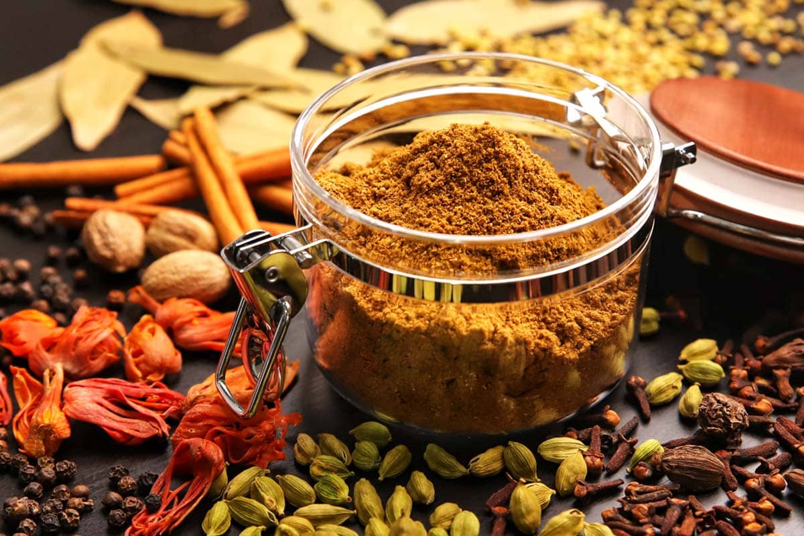
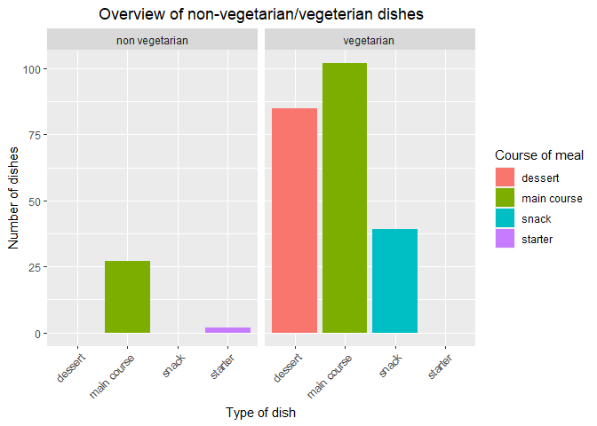
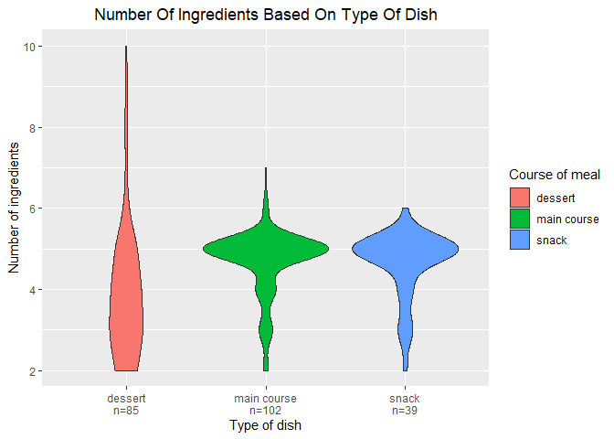
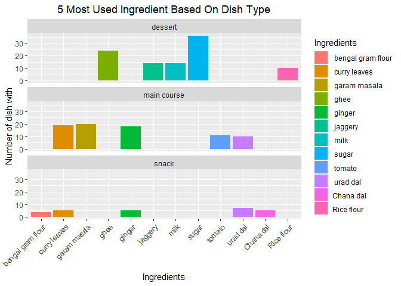
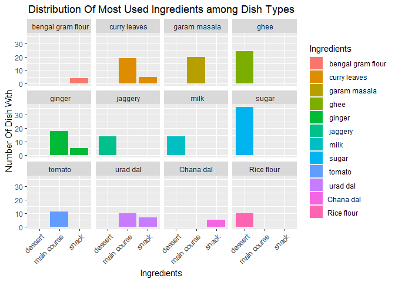

A Closer Look At Indian Cuisine With Data Science
================
Didier Yourassoff
(10 décembre, 2022)

-   <a href="#introduction" id="toc-introduction">Introduction</a>
-   <a href="#diving-into-the-data-set"
    id="toc-diving-into-the-data-set">Diving Into The Data Set</a>
-   <a href="#research-question-and-hypotheses"
    id="toc-research-question-and-hypotheses">Research Question And
    Hypotheses</a>
    -   <a href="#hypotheses" id="toc-hypotheses">Hypotheses</a>
        -   <a href="#null-hypothesis" id="toc-null-hypothesis">Null Hypothesis</a>
        -   <a href="#alternative-hypothesis"
            id="toc-alternative-hypothesis">Alternative Hypothesis</a>
-   <a href="#what-is-to-be-kept-in-all-this-data"
    id="toc-what-is-to-be-kept-in-all-this-data">What Is To Be Kept In All
    This Data?</a>
-   <a href="#how-many-ingredients-per-dish"
    id="toc-how-many-ingredients-per-dish">How Many Ingredients Per
    Dish?</a>
    -   <a href="#statistics" id="toc-statistics">Statistics</a>
        -   <a href="#description-of-the-variables"
            id="toc-description-of-the-variables">Description Of The Variables</a>
        -   <a href="#statistical-assumptions"
            id="toc-statistical-assumptions">Statistical Assumptions</a>
        -   <a href="#kruskal-wallis-test"
            id="toc-kruskal-wallis-test">Kruskal-Wallis’ Test</a>
-   <a href="#what-are-the-most-commonly-used-ingredients"
    id="toc-what-are-the-most-commonly-used-ingredients">What Are The Most
    Commonly Used Ingredients?</a>
    -   <a href="#format-the-longer-the-better"
        id="toc-format-the-longer-the-better">Format: The Longer, The Better</a>
    -   <a href="#getting-visual" id="toc-getting-visual">Getting Visual</a>
-   <a href="#conclusion" id="toc-conclusion">Conclusion</a>
-   <a href="#references" id="toc-references">References</a>

------------------------------------------------------------------------



------------------------------------------------------------------------

This report uses the [R programming
language](https://cran.r-project.org/doc/FAQ/R-FAQ.html) (R Core Team
2021) and the following [R libraries](https://r-pkgs.org/intro.html)
(Fox and Weisberg 2019; Wickham et al. 2019; Xie 2021).

``` r
#Import libraries
library(car)
library(tidyverse)
library(knitr)
```

------------------------------------------------------------------------

# Introduction

My friends like to describe me as a gourmet. I love to eat, to cook.
Food is an integral part of my life, as I am sure it is of yours. Life
made me discover Indian food a little more deeply at the beginning of
this year. I have been interested in it ever since. So much so that
while searching for data for my data practical, I came across a data set
listing lots of Indian dishes. Bingo! No need to continue the research.
I have my raw material for my work. The subject interests me and at the
same time I can learn more about this spicy cuisine. Let’s go!

So I’m going to work with the [Indian Food
101](https://www.kaggle.com/datasets/nehaprabhavalkar/indian-food-101)
data set assembled by Neha Prabhavalkar. I have retrieved the data from
[Kaggle](https://www.kaggle.com/datasets), a site known for listing a
large number of datasets. According to the description provided with the
data set [Indian Food
101](https://www.kaggle.com/datasets/nehaprabhavalkar/indian-food-101),
it contains information about 255 traditional Indian dishes: including
the ingredients required to make them, the place of origin of the dishes
and many other elements. To learn more, let’s take a look at the data!

------------------------------------------------------------------------

# Diving Into The Data Set

First, I will import the data and display the first rows of the table.

``` r
#Import data from github repository
IndianFood_df <- read_csv(url("https://raw.githubusercontent.com/DidierYourassoff/IntroDataScience/main/indian_food.csv"))
#Display the first lines of the table
head(IndianFood_df) %>% kable()
```

| name           | ingredients                                                                                    | diet       | prep_time | cook_time | flavor_profile | course  | state       | region |
|:---------------|:-----------------------------------------------------------------------------------------------|:-----------|----------:|----------:|:---------------|:--------|:------------|:-------|
| Balu shahi     | Maida flour, yogurt, oil, sugar                                                                | vegetarian |        45 |        25 | sweet          | dessert | West Bengal | East   |
| Boondi         | Gram flour, ghee, sugar                                                                        | vegetarian |        80 |        30 | sweet          | dessert | Rajasthan   | West   |
| Gajar ka halwa | Carrots, milk, sugar, ghee, cashews, raisins                                                   | vegetarian |        15 |        60 | sweet          | dessert | Punjab      | North  |
| Ghevar         | Flour, ghee, kewra, milk, clarified butter, sugar, almonds, pistachio, saffron, green cardamom | vegetarian |        15 |        30 | sweet          | dessert | Rajasthan   | West   |
| Gulab jamun    | Milk powder, plain flour, baking powder, ghee, milk, sugar, water, rose water                  | vegetarian |        15 |        40 | sweet          | dessert | West Bengal | East   |
| Imarti         | Sugar syrup, lentil flour                                                                      | vegetarian |        10 |        50 | sweet          | dessert | West Bengal | East   |

From the first lines, and the names of the columns, I can already see
that I have a column for the name of each dish, one for the necessary
ingredients, one for the diet, one for the preparation time, one for the
cooking time, one for the course of meal, one for the flavor profile,
one for the state of origin and finally one for the region of origin of
each dish.

Also, as it stands, for the ingredients column, I see that there are
several ingredients listed in one cell, while the other columns contain
one piece of information per cell. For example, there is only one region
or preparation time for each dish. I will come back to this later.

Now let’s look at the last few rows of the table.

``` r
#Display the last lines of the table
tail(IndianFood_df) %>% kable()
```

| name      | ingredients                                                           | diet       | prep_time | cook_time | flavor_profile | course      | state           | region     |
|:----------|:----------------------------------------------------------------------|:-----------|----------:|----------:|:---------------|:------------|:----------------|:-----------|
| Shukto    | Green beans, bitter gourd, ridge gourd, banana, brinjal               | vegetarian |        10 |        20 | spicy          | main course | West Bengal     | East       |
| Til Pitha | Glutinous rice, black sesame seeds, gur                               | vegetarian |         5 |        30 | sweet          | dessert     | Assam           | North East |
| Bebinca   | Coconut milk, egg yolks, clarified butter, all purpose flour          | vegetarian |        20 |        60 | sweet          | dessert     | Goa             | West       |
| Shufta    | Cottage cheese, dry dates, dried rose petals, pistachio, badam        | vegetarian |        -1 |        -1 | sweet          | dessert     | Jammu & Kashmir | North      |
| Mawa Bati | Milk powder, dry fruits, arrowroot powder, all purpose flour          | vegetarian |        20 |        45 | sweet          | dessert     | Madhya Pradesh  | Central    |
| Pinaca    | Brown rice, fennel seeds, grated coconut, black pepper, ginger powder | vegetarian |        -1 |        -1 | sweet          | dessert     | Goa             | West       |

The last lines don’t give much more information than the first lines. I
see, for example, concerning the flavor profile, a new value, “spicy”,
where I had only “sweet” in the first lines. Similarly, concerning the
course column, a new value “main course”, where I had only “dessert”.

However, when I look at these last lines, I discover cells with the
value (-1). According to the description provided with the data set,
this is a convention to notify cells that have no assigned values.
Preferring to work with NA’s, I will replace each value (-1) with a NA
in the data set.

Here is what the last rows of the table look like now.

``` r
#Replacing (-1) with NA
IndianFood_df <- na_if(IndianFood_df, -1)

tail(IndianFood_df) %>% kable()
```

| name      | ingredients                                                           | diet       | prep_time | cook_time | flavor_profile | course      | state           | region     |
|:----------|:----------------------------------------------------------------------|:-----------|----------:|----------:|:---------------|:------------|:----------------|:-----------|
| Shukto    | Green beans, bitter gourd, ridge gourd, banana, brinjal               | vegetarian |        10 |        20 | spicy          | main course | West Bengal     | East       |
| Til Pitha | Glutinous rice, black sesame seeds, gur                               | vegetarian |         5 |        30 | sweet          | dessert     | Assam           | North East |
| Bebinca   | Coconut milk, egg yolks, clarified butter, all purpose flour          | vegetarian |        20 |        60 | sweet          | dessert     | Goa             | West       |
| Shufta    | Cottage cheese, dry dates, dried rose petals, pistachio, badam        | vegetarian |        NA |        NA | sweet          | dessert     | Jammu & Kashmir | North      |
| Mawa Bati | Milk powder, dry fruits, arrowroot powder, all purpose flour          | vegetarian |        20 |        45 | sweet          | dessert     | Madhya Pradesh  | Central    |
| Pinaca    | Brown rice, fennel seeds, grated coconut, black pepper, ginger powder | vegetarian |        NA |        NA | sweet          | dessert     | Goa             | West       |

Now let’s take a broader perspective by starting with the `str()`
function.

``` r
#Display the structure of the data set
str(IndianFood_df)
```

    ## spec_tbl_df [255 × 9] (S3: spec_tbl_df/tbl_df/tbl/data.frame)
    ##  $ name          : chr [1:255] "Balu shahi" "Boondi" "Gajar ka halwa" "Ghevar" ...
    ##  $ ingredients   : chr [1:255] "Maida flour, yogurt, oil, sugar" "Gram flour, ghee, sugar" "Carrots, milk, sugar, ghee, cashews, raisins" "Flour, ghee, kewra, milk, clarified butter, sugar, almonds, pistachio, saffron, green cardamom" ...
    ##  $ diet          : chr [1:255] "vegetarian" "vegetarian" "vegetarian" "vegetarian" ...
    ##  $ prep_time     : num [1:255] 45 80 15 15 15 10 10 10 20 10 ...
    ##  $ cook_time     : num [1:255] 25 30 60 30 40 50 50 20 30 40 ...
    ##  $ flavor_profile: chr [1:255] "sweet" "sweet" "sweet" "sweet" ...
    ##  $ course        : chr [1:255] "dessert" "dessert" "dessert" "dessert" ...
    ##  $ state         : chr [1:255] "West Bengal" "Rajasthan" "Punjab" "Rajasthan" ...
    ##  $ region        : chr [1:255] "East" "West" "North" "West" ...
    ##  - attr(*, "spec")=
    ##   .. cols(
    ##   ..   name = col_character(),
    ##   ..   ingredients = col_character(),
    ##   ..   diet = col_character(),
    ##   ..   prep_time = col_double(),
    ##   ..   cook_time = col_double(),
    ##   ..   flavor_profile = col_character(),
    ##   ..   course = col_character(),
    ##   ..   state = col_character(),
    ##   ..   region = col_character()
    ##   .. )
    ##  - attr(*, "problems")=<externalptr>

Here I see that the data set represents 255 rows and 9 columns. Among
the 9 columns, there are 2 of type numeric (num) and 7 of type character
(chr). Then, I can get a synthetic overview thanks to the `summary()`
function.

``` r
#Display a synthetic overview
summary(IndianFood_df)
```

    ##      name           ingredients            diet             prep_time     
    ##  Length:255         Length:255         Length:255         Min.   :  5.00  
    ##  Class :character   Class :character   Class :character   1st Qu.: 10.00  
    ##  Mode  :character   Mode  :character   Mode  :character   Median : 10.00  
    ##                                                           Mean   : 35.39  
    ##                                                           3rd Qu.: 20.00  
    ##                                                           Max.   :500.00  
    ##                                                           NA's   :30      
    ##    cook_time      flavor_profile        course             state          
    ##  Min.   :  2.00   Length:255         Length:255         Length:255        
    ##  1st Qu.: 20.00   Class :character   Class :character   Class :character  
    ##  Median : 30.00   Mode  :character   Mode  :character   Mode  :character  
    ##  Mean   : 38.91                                                           
    ##  3rd Qu.: 45.00                                                           
    ##  Max.   :720.00                                                           
    ##  NA's   :28                                                               
    ##     region         
    ##  Length:255        
    ##  Class :character  
    ##  Mode  :character  
    ##                    
    ##                    
    ##                    
    ## 

What do we have this time? I see several interesting pieces of
information for the prep_time and cook_time columns, namely the mean,
the median. Also for prep_time I have 30 NA’s, which means that the
preparation time is not filled in for 30 dishes; similarly, I have 28
NA’s for cook_time, which means that the cooking time is not filled in
for 28 dishes.

For the rest of the columns, I only retain one length information being
255 for all. This echoes the 255 rows that the table has as indicated by
the `str()` function above. That said, I can get more information from
the `str()` and `summary()` functions by turning the character columns
into factor ones.

Here is the structure with the type conversions of the columns.

``` r
#Convert character columns as factor ones
IndianFood_df <- IndianFood_df %>%
  mutate_if(is.character, as.factor)

str(IndianFood_df)
```

    ## tibble [255 × 9] (S3: tbl_df/tbl/data.frame)
    ##  $ name          : Factor w/ 255 levels "Adhirasam","Aloo gobi",..: 14 28 72 77 81 88 89 97 99 112 ...
    ##  $ ingredients   : Factor w/ 252 levels "Aloo, tomatoes, mustard oil, bay leaf, cinnamon stick",..: 123 101 36 96 130 213 124 37 131 133 ...
    ##  $ diet          : Factor w/ 2 levels "non vegetarian",..: 2 2 2 2 2 2 2 2 2 2 ...
    ##  $ prep_time     : num [1:255] 45 80 15 15 15 10 10 10 20 10 ...
    ##  $ cook_time     : num [1:255] 25 30 60 30 40 50 50 20 30 40 ...
    ##  $ flavor_profile: Factor w/ 4 levels "bitter","sour",..: 4 4 4 4 4 4 4 4 4 4 ...
    ##  $ course        : Factor w/ 4 levels "dessert","main course",..: 1 1 1 1 1 1 1 1 1 1 ...
    ##  $ state         : Factor w/ 24 levels "Andhra Pradesh",..: 24 18 17 18 24 24 22 NA 24 NA ...
    ##  $ region        : Factor w/ 6 levels "Central","East",..: 2 6 3 6 2 2 3 NA 2 NA ...

And the output of the `summary()` function.

``` r
summary(IndianFood_df)
```

    ##                 name    
    ##  Adhirasam        :  1  
    ##  Aloo gobi        :  1  
    ##  Aloo matar       :  1  
    ##  Aloo methi       :  1  
    ##  Aloo shimla mirch:  1  
    ##  Aloo tikki       :  1  
    ##  (Other)          :249  
    ##                                                                     ingredients 
    ##  Arbi ke patte, sesame seeds, gur, bengal gram flour, imli                :  2  
    ##  Chhena, sugar, ghee                                                      :  2  
    ##  Gram flour, ghee, sugar                                                  :  2  
    ##  Aloo, tomatoes, mustard oil, bay leaf, cinnamon stick                    :  1  
    ##  Aloo, urad dal, mustard, ginger, curry leaves                            :  1  
    ##  Amaranth leaves, split urad dal, mustard seeds, grated coconut, red chili:  1  
    ##  (Other)                                                                  :246  
    ##              diet       prep_time        cook_time      flavor_profile
    ##  non vegetarian: 29   Min.   :  5.00   Min.   :  2.00   bitter:  4    
    ##  vegetarian    :226   1st Qu.: 10.00   1st Qu.: 20.00   sour  :  1    
    ##                       Median : 10.00   Median : 30.00   spicy :133    
    ##                       Mean   : 35.39   Mean   : 38.91   sweet : 88    
    ##                       3rd Qu.: 20.00   3rd Qu.: 45.00   NA's  : 29    
    ##                       Max.   :500.00   Max.   :720.00                 
    ##                       NA's   :30       NA's   :28                     
    ##          course            state           region  
    ##  dessert    : 85   Gujarat    :35   Central   : 3  
    ##  main course:129   Punjab     :32   East      :31  
    ##  snack      : 39   Maharashtra:30   North     :49  
    ##  starter    :  2   West Bengal:24   North East:25  
    ##                    Assam      :21   South     :59  
    ##                    (Other)    :89   West      :74  
    ##                    NA's       :24   NA's      :14

I will consider one column after another.

First, using the `str()` function, I see that the name column contains
“255 levels”, which means that there are 255 unique names, or one name
for each dish. This corroborates the description of the data set given
in the introduction.

Similarly, the function `str()` indicates that the ingredients column
contains “252 levels”, which means that there are 252 combinations of
ingredients. And since there are 255 dishes referenced for 252
ingredient combinations, this means that some dishes have the same
ingredient combination. I can verify this by looking at the output of
the `summary()` function, which indeed shows two occurrences for each of
the following combinations:

-   “Arbi ke patte, sesame seeds, gur, bengal gram flour, imli”
-   “Chhena, sugar, ghee”
-   “Gram flour, ghee, sugar”.

Then, for the diet column, I note from the `str()` function that there
are “2 levels”. And the output of the `summary()` function explains the
two types of meals they refer to, namely “non-vegetarian” and
“vegetarian”.

I won’t dwell on the prep_time and cook_time columns here, since they
were not affected by the column type conversion.

For the flavor profile, the `str()` function displays “4 levels”, which
I find in the output of `summary()`, namely “bitter”, “sour”, “spicy”,
“sweet”. I also note that there are 28 NA’s, which means that 28 dishes
have no value assigned for the flavor profile.

Then, for the course column, the `str()` function returns “4 levels”,
and `summary()` describes “dessert”, “main course”, “snack”, “starter”.

For the state column, the `str()` function returns “24 levels”. That is,
24 different states. On the other hand, the `summary()` function makes
explicit only the five largest states in terms of number of associated
dishes; the others appear as “(Other)” in addition to the NA’s. Still,
24 is a possible and consistent number given that India has 29 states
and seven union territories (Dandona et al. 2017).

Finally, for the original region column, I get from the `str()` function
“6 levels”, which are summarized by the `summary()` function as follows:
“Central”, “East”, “North”, “North East”, “South”, “West”, and NA’s.

That’s fine. This gives us a first impression of what is in our data
set. A first impression that raises a lot of questions for me. I will
address them in the next section.

------------------------------------------------------------------------

# Research Question And Hypotheses

Exploring this data set, I wonder if the course of meal has an influence
on the number of ingredients in a dish, but also on which ingredients
are used. In other words, does the fact of being a main course imply to
have more ingredients on average compared to a dessert for example. And,
do desserts have completely different ingredients than snacks typically.
To answer these questions, I will work with two hypotheses.

## Hypotheses

Let’s pose the two hypotheses that will guide the rest of this report.

### Null Hypothesis

-   H0: The course of meal of a dish, i.e. being a dessert, a main
    course, a starter, or a snack, has no impact on the number of
    ingredients used on average for the dish nor on which ingredients
    are used.

### Alternative Hypothesis

-   HA: The course of meal of a dish, i.e., being a dessert, main
    course, starter, or snack, has an impact on the number of
    ingredients used on average for the dish and also on which
    ingredients are used.

------------------------------------------------------------------------

# What Is To Be Kept In All This Data?

Given my hypotheses, I will not keep all the columns and rows of the
data set. Not everything is relevant to test the them. To be convinced
of this, let’s consider the graph below.

``` r
IndianFood_df %>%
  ggplot(aes(x = course, fill = course)) + 
  geom_bar() +
  #Display subplots based on the diet type
  facet_wrap(~ diet) +
  #Set labels for x axis, y axis, fill parameter, main title
  labs(x = "Type of dish", y = "Number of dishes", fill = "Course of meal", title = "Overview of non-vegetarian/vegeterian dishes") +
  #Angle the x axis labels  
  guides(x = guide_axis(angle = 45)) +
  #Center the main title
  theme(plot.title = element_text(hjust = 0.5))
```

<!-- -->

This graph shows from the whole data set, the number of dishes that
correspond to a dessert, a main course, a snack and a starter while
separating the vegetarian dishes from the non-vegetarian dishes. So I
can see that on one side there are no non-vegetarian desserts or snacks
and on the other side there are no vegetarian starters. For the desserts
it is not a big discovery since it is not every day that you see meat in
a dessert. On the other hand, as far as snacks and starters are
concerned, it is a little less predictable.

More generally, this graph shows that the majority of dishes are
vegetarians. That’s why I suggest focusing on those. Since there is
therefore no vegetarian starter, I will remove the starter level from
the corresponding factor when selecting the data. I will do the same for
all the factors showing a null level. This said, these remarks are
mostly about the rows of the two columns course and diet. What about the
rest of the columns?

Among all the columns of the data set, I will only keep the name,
ingredients, diet, and course columns:

-   The name column identifies each dish, like an ID.
-   The ingredients column contains information about the ingredients,
    which are essential to answer my hypotheses.
-   The diet column allows me to separate my data: once I have made the
    selection of vegetarian dishes, I will delete it because each
    selected dish will be stamped vegetarian and the column will not
    allow any distinction in the new data set.
-   The course column contains information about the position in the
    course of the meal of each dish, which is essential to answer my
    hypotheses.

In view of my hypotheses, I will not keep the prep_time, cook_time,
region, and state columns. Indeed, I choose to exclude the geographical
information on the origin of the dishes as well as the temporal
information to realize them because they are not relevant. How is the
selection of columns and rows translated in the code?

Here is a way to do it:

``` r
#Selection of the relevant data  
Relevantfood <- IndianFood_df %>%
  #Filter vegetarian meal
  filter(diet=="vegetarian") %>%
  #Select relevant columns 
  select(name, course, ingredients)
#Remove null factor level in the data set 
Relevantfood <- droplevels.data.frame(Relevantfood)
```

And here is the corresponding structure:

``` r
str(Relevantfood)
```

    ## tibble [226 × 3] (S3: tbl_df/tbl/data.frame)
    ##  $ name       : Factor w/ 226 levels "Adhirasam","Aloo gobi",..: 13 22 59 63 67 73 74 81 83 96 ...
    ##  $ course     : Factor w/ 3 levels "dessert","main course",..: 1 1 1 1 1 1 1 1 1 1 ...
    ##  $ ingredients: Factor w/ 223 levels "Aloo, urad dal, mustard, ginger, curry leaves",..: 102 82 30 78 108 184 103 31 109 111 ...

So I have 226 recipes left to work with as indicated by the “226 levels”
in the name column at the output of the `str()` function. I come back to
my hypothesis.

The null hypothesis is divided in two parts, since it is about the
number of ingredients used on average for a dish and about the
ingredients used. I will continue with the first part in the following
section.

------------------------------------------------------------------------

# How Many Ingredients Per Dish?

As you may have noticed, I don’t have a column that gives the number of
ingredients for each dish for the moment. On the other hand, as
mentioned above, the ingredients column gathers all the ingredients of
each recipe in the same cell. And if I look closely, I see that each
ingredient is separated by a comma in the same cell. So, if I can count
the number of commas in the ingredients cell for each recipe, I can
deduce the number of ingredients in the recipe: to be clear, it’s the
number of commas plus one since a comma separates two ingredients. Let’s
do it!

``` r
NbrIngPerDish <- Relevantfood %>%
  #Create a new column called NbrIng and calculate the sum of ingredients used in each recipe
  mutate(Relevantfood, NbrIng = (str_count(ingredients, ",") +1))
```

Here are the first lines, the recipes with the most ingredients at the
top:

``` r
  NbrIngPerDish %>%
  #Sort in descending order
  arrange(desc(NbrIng)) %>%
  head() %>%
  kable()
```

| name           | course      | ingredients                                                                                    | NbrIng |
|:---------------|:------------|:-----------------------------------------------------------------------------------------------|-------:|
| Ghevar         | dessert     | Flour, ghee, kewra, milk, clarified butter, sugar, almonds, pistachio, saffron, green cardamom |     10 |
| Jalebi         | dessert     | Maida, corn flour, baking soda, vinegar, curd, water, turmeric, saffron, cardamom              |      9 |
| Gulab jamun    | dessert     | Milk powder, plain flour, baking powder, ghee, milk, sugar, water, rose water                  |      8 |
| Mysore pak     | dessert     | Besan flour, semolina, mung bean, jaggery, coconut, skimmed milk powder, sugar, ghee           |      8 |
| Bandar laddu   | dessert     | Besan, jaggery, cardamom powder, ghee, cashews and raisins, jaggery syrup, sugar               |      7 |
| Obbattu holige | main course | Maida flour, turmeric, coconut, chickpeas, jaggery, ghee, cardamom                             |      7 |

I note here that the maximum number of ingredients for a recipe is 10
and this is a dessert. I now call the `summary()` function for more
details.

``` r
summary(NbrIngPerDish)
```

    ##                 name             course   
    ##  Adhirasam        :  1   dessert    : 85  
    ##  Aloo gobi        :  1   main course:102  
    ##  Aloo matar       :  1   snack      : 39  
    ##  Aloo methi       :  1                    
    ##  Aloo shimla mirch:  1                    
    ##  Aloo tikki       :  1                    
    ##  (Other)          :220                    
    ##                                                                     ingredients 
    ##  Arbi ke patte, sesame seeds, gur, bengal gram flour, imli                :  2  
    ##  Chhena, sugar, ghee                                                      :  2  
    ##  Gram flour, ghee, sugar                                                  :  2  
    ##  Aloo, urad dal, mustard, ginger, curry leaves                            :  1  
    ##  Amaranth leaves, split urad dal, mustard seeds, grated coconut, red chili:  1  
    ##  Apricots, sugar syrup                                                    :  1  
    ##  (Other)                                                                  :217  
    ##      NbrIng      
    ##  Min.   : 2.000  
    ##  1st Qu.: 4.000  
    ##  Median : 5.000  
    ##  Mean   : 4.367  
    ##  3rd Qu.: 5.000  
    ##  Max.   :10.000  
    ## 

The output of the `summary()` function provides the number of recipes
according to course of meal. In figures, 39 recipes of snacks, 85
desserts and 102 main course. I note that there were already 85 desserts
in the whole data set, i.e. the one containing vegetarian and
non-vegetarian dishes. However, the graph I mentioned above clearly
shows that all the desserts are vegetarian. This is why I get the same
number of desserts in the filtered data set with only vegetarian dishes.
The same reasoning applies for the snacks.

Now the idea is to assess if one type of dish requires more or less
ingredients than another. I will start by visualizing the distribution
of the number of ingredients per dish according to the type of dish.

``` r
# Calculate the number of dishes, i.e. sample size 
sample_size = NbrIngPerDish %>%
  group_by(course) %>%
  summarise(num = n())

NbrIngPerDish %>%
  #Add sample size data to data set
  left_join(sample_size) %>%
  #Create a column to display sample size 
  mutate(myaxis = paste0(course, "\n", "n=", num)) %>%
  ggplot(aes(x = myaxis, y = NbrIng, fill = course)) +
    geom_violin() +
    labs(x = "Type of dish", y = "Number of ingredients", fill = "Course of meal", title = "Number Of Ingredients Based On Type Of Dish") +
  theme(plot.title = element_text(hjust = 0.5))
```

<!-- -->

This graph illustrates that main courses and snacks are most often made
up of 5 ingredients each. Desserts, on the other hand, are most often
made up of only 3-4 ingredients. Thus, the first part of my hypothesis
appears to be false. That is, whether to be a dessert, or a main course,
or a snack has an influence on the number of ingredients used. I will
put these results to the statistical test to see if it is significant.

## Statistics

### Description Of The Variables

Here, I want to compare the means of the number of ingredients used of
three groups: desserts, main courses and snacks. These groups correspond
to the independent variable type of dish. This is a categorical one.
Then, the average of the ingredients used is the dependent variable,
quantitative. Thus, under these conditions, the appropriate test would
be ANOVA. However, I have to check several assumptions before performing
this test. If the assumptions are not satisfied, I will have to use the
non-parametric version of this test, namely Kruskal-Wallis.

### Statistical Assumptions

#### Independence Of Observations

Each dish is unique and cannot be a of two type at the same time in this
data set. Therefore, the independence of observations is satisfied.

#### Homogeneity Of Variance

To assess the homogeneity of variance, I can use Levene’s test. It uses
an F-test to test the null hypothesis that the variance is equal across
groups. A p value less than 0.05 indicates a violation of the
assumption. Here is what it looks like in the code:

``` r
#Levene's Test (Number of Ingredient per dish ~ course, data = NbrIngPerDish)
leveneTest(NbrIng ~ course, data = NbrIngPerDish)
```

    ## Levene's Test for Homogeneity of Variance (center = median)
    ##        Df F value    Pr(>F)    
    ## group   2  18.762 2.944e-08 ***
    ##       223                      
    ## ---
    ## Signif. codes:  0 '***' 0.001 '**' 0.01 '*' 0.05 '.' 0.1 ' ' 1

I get a p value smaller than 0.05, which means that the test is
significant. In other words, the assumption of homogeneity of variance
is violated. Therefore, I will have to adopt the non-parametric version
of ANOVA that I wanted to do. That said, for completeness I will still
evaluate the third assumption, the normality of Data.

#### Normality Of Data

To assess normality of Data, I can use Shapiro-Wilk’s test. Again, if I
get a p value less than 0.05, it indicates a violation of the
assumption. Let’s try it!

``` r
#Test normality of Datat
shapiro.test(NbrIngPerDish$NbrIng)
```

    ## 
    ##  Shapiro-Wilk normality test
    ## 
    ## data:  NbrIngPerDish$NbrIng
    ## W = 0.82842, p-value = 4.473e-15

I get a p value smaller than 0.05, which means that the test is
significant. In other words, the assumption of normality of data is not
satisfied. So, out of the three assumptions, my data fail to satisfy two
of them. For this reason, I will use the non-parametric version of
ANOVA, namely Kruskal-Wallis.

### Kruskal-Wallis’ Test

Here is what I get for the Kruskal-Wallis test:

``` r
#Non-parametric test to compare between more than 2 groups
kruskal.test(NbrIng ~ course, data = NbrIngPerDish)
```

    ## 
    ##  Kruskal-Wallis rank sum test
    ## 
    ## data:  NbrIng by course
    ## Kruskal-Wallis chi-squared = 39.801, df = 2, p-value = 2.277e-09

The p value is smaller than 0.001 (p value \< 0.001), I can then say
that there are significant differences in the number of ingredients used
between the following groups: main course, dessert, snack. Thus, the
first part of my null hypothesis (H0) is rejected.

In the next section, I will look at what ingredients are most commonly
used, and whether that changes from one type of dish to another.

------------------------------------------------------------------------

# What Are The Most Commonly Used Ingredients?

Now if I want to work on the most commonly used ingredients in a
practical way, I will have to tidy up my data. That is to say, at the
beginning, I highlighted that a single cell contained all the
ingredients for a given recipe. The idea is then to work on these cells
to obtain one ingredient per cell for each recipe, i.e. one information
per cell, in short tidy data.

## Format: The Longer, The Better

I showed above that the maximum number of ingredients for a recipe is
10. This implies that in order to separate my ingredient column, I must
spread it out over 10 columns, or one ingredient per column. Recipes
with less than 10 ingredients will have NA’s. In terms of code, I use
the `separate()` function which asks for a vector to name the new
columns that will appear.

``` r
#Create a vector to name the new column afterward
NewColNames <- c("ing1","ing2","ing3","ing4","ing5","ing6","ing7","ing8","ing9","ing10")

NbrDishwtIng_wide <- NbrIngPerDish %>%
  #Split ingredient column
  separate(ingredients, NewColNames, sep=",")
```

Here is the resulting structure:

``` r
str(NbrDishwtIng_wide)
```

    ## tibble [226 × 13] (S3: tbl_df/tbl/data.frame)
    ##  $ name  : Factor w/ 226 levels "Adhirasam","Aloo gobi",..: 13 22 59 63 67 73 74 81 83 96 ...
    ##  $ course: Factor w/ 3 levels "dessert","main course",..: 1 1 1 1 1 1 1 1 1 1 ...
    ##  $ ing1  : chr [1:226] "Maida flour" "Gram flour" "Carrots" "Flour" ...
    ##  $ ing2  : chr [1:226] " yogurt" " ghee" " milk" " ghee" ...
    ##  $ ing3  : chr [1:226] " oil" " sugar" " sugar" " kewra" ...
    ##  $ ing4  : chr [1:226] " sugar" NA " ghee" " milk" ...
    ##  $ ing5  : chr [1:226] NA NA " cashews" " clarified butter" ...
    ##  $ ing6  : chr [1:226] NA NA " raisins" " sugar" ...
    ##  $ ing7  : chr [1:226] NA NA NA " almonds" ...
    ##  $ ing8  : chr [1:226] NA NA NA " pistachio" ...
    ##  $ ing9  : chr [1:226] NA NA NA " saffron" ...
    ##  $ ing10 : chr [1:226] NA NA NA " green cardamom" ...
    ##  $ NbrIng: num [1:226] 4 3 6 10 8 2 9 4 3 4 ...

And the first lines of the table:

``` r
head(NbrDishwtIng_wide) %>% kable()
```

| name           | course  | ing1        | ing2         | ing3          | ing4  | ing5             | ing6    | ing7    | ing8       | ing9    | ing10          | NbrIng |
|:---------------|:--------|:------------|:-------------|:--------------|:------|:-----------------|:--------|:--------|:-----------|:--------|:---------------|-------:|
| Balu shahi     | dessert | Maida flour | yogurt       | oil           | sugar | NA               | NA      | NA      | NA         | NA      | NA             |      4 |
| Boondi         | dessert | Gram flour  | ghee         | sugar         | NA    | NA               | NA      | NA      | NA         | NA      | NA             |      3 |
| Gajar ka halwa | dessert | Carrots     | milk         | sugar         | ghee  | cashews          | raisins | NA      | NA         | NA      | NA             |      6 |
| Ghevar         | dessert | Flour       | ghee         | kewra         | milk  | clarified butter | sugar   | almonds | pistachio  | saffron | green cardamom |     10 |
| Gulab jamun    | dessert | Milk powder | plain flour  | baking powder | ghee  | milk             | sugar   | water   | rose water | NA      | NA             |      8 |
| Imarti         | dessert | Sugar syrup | lentil flour | NA            | NA    | NA               | NA      | NA      | NA         | NA      | NA             |      2 |

Then, I will transform this table, which now corresponds rather to a
large format, into a long format with the function `pivot_longer()`:

``` r
NbrDishwtIng_long <- NbrDishwtIng_wide %>%
  #Transform the wide format to a long format 
  pivot_longer(ing1:ing10, names_to = "IngRank", values_to = "Ing")
```

Here is the resulting structure:

``` r
str(NbrDishwtIng_long)
```

    ## tibble [2,260 × 5] (S3: tbl_df/tbl/data.frame)
    ##  $ name   : Factor w/ 226 levels "Adhirasam","Aloo gobi",..: 13 13 13 13 13 13 13 13 13 13 ...
    ##  $ course : Factor w/ 3 levels "dessert","main course",..: 1 1 1 1 1 1 1 1 1 1 ...
    ##  $ NbrIng : num [1:2260] 4 4 4 4 4 4 4 4 4 4 ...
    ##  $ IngRank: chr [1:2260] "ing1" "ing2" "ing3" "ing4" ...
    ##  $ Ing    : chr [1:2260] "Maida flour" " yogurt" " oil" " sugar" ...

As at the very beginning, I will transform the character columns into
factor one to get the most out of the `summary()` function. Here is what
I get:

``` r
NbrDishwtIng_long <- NbrDishwtIng_long %>%
  mutate_if(is.character, as.factor)

summary(NbrDishwtIng_long)
```

    ##                 name              course         NbrIng          IngRank   
    ##  Adhirasam        :  10   dessert    : 850   Min.   : 2.000   ing1   :226  
    ##  Aloo gobi        :  10   main course:1020   1st Qu.: 4.000   ing10  :226  
    ##  Aloo matar       :  10   snack      : 390   Median : 5.000   ing2   :226  
    ##  Aloo methi       :  10                      Mean   : 4.367   ing3   :226  
    ##  Aloo shimla mirch:  10                      3rd Qu.: 5.000   ing4   :226  
    ##  Aloo tikki       :  10                      Max.   :10.000   ing5   :226  
    ##  (Other)          :2200                                       (Other):904  
    ##             Ing      
    ##   sugar       :  43  
    ##   ghee        :  25  
    ##   curry leaves:  24  
    ##   garam masala:  23  
    ##   ginger      :  23  
    ##  (Other)      : 849  
    ##  NA's         :1273

Here, I immediately see a large number of NA’s for the Ing column: this
is because of the empty boxes corresponding to recipes with less than 10
ingredients. As a reminder, the maximum is 10, and there is only one
recipe that has that many. So I propose to clean up the data a bit to
see it more clearly, i.e. filter the NA’s and delete the IngRank column
which comes from the change of format from wide to long.

``` r
NbrDishwtIng_clean <- NbrDishwtIng_long %>%
  #Remove NA'S rows
  filter(!is.na(Ing)) %>%
  #Remove IngRank column
  select(-IngRank)
```

And here is the structure of the data once cleaned up. Then, I display
the output of the `summary()` function.

``` r
str(NbrDishwtIng_clean)
```

    ## tibble [987 × 4] (S3: tbl_df/tbl/data.frame)
    ##  $ name  : Factor w/ 226 levels "Adhirasam","Aloo gobi",..: 13 13 13 13 22 22 22 59 59 59 ...
    ##  $ course: Factor w/ 3 levels "dessert","main course",..: 1 1 1 1 1 1 1 1 1 1 ...
    ##  $ NbrIng: num [1:987] 4 4 4 4 3 3 3 6 6 6 ...
    ##  $ Ing   : Factor w/ 377 levels "  jaggery"," all purpose flour",..: 327 261 167 224 310 108 224 283 154 224 ...

``` r
summary(NbrDishwtIng_clean)
```

    ##              name             course        NbrIng                  Ing     
    ##  Ghevar        : 10   dessert    :328   Min.   : 2.000    sugar       : 43  
    ##  Jalebi        :  9   main course:478   1st Qu.: 4.000    ghee        : 25  
    ##  Gulab jamun   :  8   snack      :181   Median : 5.000    curry leaves: 24  
    ##  Mysore pak    :  8                     Mean   : 4.716    garam masala: 23  
    ##  Bandar laddu  :  7                     3rd Qu.: 5.000    ginger      : 23  
    ##  Obbattu holige:  7                     Max.   :10.000    jaggery     : 19  
    ##  (Other)       :938                                      (Other)      :830

So I end up with a table here of 4 columns for 987 rows according to the
`str()` function. And thanks to the output of the `summary()` function,
I can notice that the 5 most used ingredients are :

-   sugar,
-   ghee,
-   curry leaves,
-   garam masala,
-   ginger.

However, these results represent all dishes regardless of type. How can
I observe the five most used ingredients for each type of dish, namely
dessert, main course and snack?

First, I will select the five most used ingredients for each type of
dish course by combining the `group_by()` and `slice()` functions.

``` r
Top5bycourse <- NbrDishwtIng_clean %>%
  #Group data according the type of dish, and the ingredients
  group_by(course, Ing) %>%
  #Count the size of group
  summarise(Nbrofdish=n()) %>%
  arrange(desc(Nbrofdish)) %>%
  #Select the first 5 rows of course & Ing grouping 
  slice(c(1:5))

Top5bycourse
```

    ## # A tibble: 15 × 3
    ## # Groups:   course [3]
    ##    course      Ing                  Nbrofdish
    ##    <fct>       <fct>                    <int>
    ##  1 dessert     " sugar"                    36
    ##  2 dessert     " ghee"                     24
    ##  3 dessert     " jaggery"                  14
    ##  4 dessert     " milk"                     14
    ##  5 dessert     "Rice flour"                10
    ##  6 main course " garam masala"             20
    ##  7 main course " curry leaves"             19
    ##  8 main course " ginger"                   18
    ##  9 main course " tomato"                   11
    ## 10 main course " urad dal"                 10
    ## 11 snack       " urad dal"                  7
    ## 12 snack       " curry leaves"              5
    ## 13 snack       " ginger"                    5
    ## 14 snack       "Chana dal"                  5
    ## 15 snack       " bengal gram flour"         4

The chart above gives the numbers I am looking for. However, I suggest
making two graphs to make things more visual.

## Getting Visual

Here is a first graph:

``` r
Top5bycourse %>%
  ggplot(aes(x = Ing, y= Nbrofdish, fill=Ing)) + 
  geom_col()  +
  facet_wrap(~course, dir="v")+
  labs(x = "Ingredients", y = "Number of dish with", fill = "Ingredients", title = "5 Most Used Ingredient Based On Dish Type") +
  guides(x = guide_axis(angle = 45)) +
  theme(plot.title = element_text(hjust = 0.5)) 
```

<!-- -->

The main thing to keep for this graph is that in the 5 most used
ingredients according to type of dish, none is common to all three at
the same time.

Here is the second graph:

``` r
Top5bycourse %>%
  ggplot(aes(x = course, y= Nbrofdish, fill=Ing)) + 
  geom_col()  +
  facet_wrap(~Ing) +
  labs(x = "Ingredients", y = "Number Of Dish With", fill = "Ingredients", title = "Distribution Of Most Used Ingredients among Dish Types") +
  guides(x = guide_axis(angle = 45)) +
  theme(plot.title = element_text(hjust = 0.5))+
  scale_x_discrete(guide = guide_axis(angle = 45))
```

<!-- -->

This second graph allows you to visualize how each ingredient, among the
most used, is distributed between the main courses, snacks and desserts.
Typically, if the graph shows a bar in one of the small windows, it
means that the ingredient is among the most used for this type of dish,
and that it is characteristic of it.

For example, for desserts, it is striking to see that the 5 most used
ingredients, namely sugar, ghee, jaggery, milk and rice floor, are not
found in the other two types. Therefore, these 5 ingredients are
particularly characteristic of this type of dish. As for the snack type,
the bengal gram flour and the Chana dal are the characteristic
ingredients and finally for the main course, the garam masala and the
tomatoes are particularly characteristic.

Finally, I note that curry leaves, urad dal and ginger are frequent in
both the snacks and the main course.

By the above, I see that the different types of meals are most
frequently made up of different ingredients. Thus the second part of my
null hypothesis(H0) is also false and I can then adopt my alternative
hypothesis (HA) which is verified by consequence.

------------------------------------------------------------------------

# Conclusion

After this analytical journey, I can conclude on the one hand that the
fact of being a dessert rather than a main course or a snack has an
influence on the number of ingredients used on average, namely between 3
and 4 for a dessert, and 5 for the main course and snack.

On the other hand, each type of dish is characterized by different
ingredients, at least for those that are used most often. And in this
respect, desserts that have no ingredients in common with the main
course and snack are particularly distinct.

------------------------------------------------------------------------

# References

<div id="refs" class="references csl-bib-body hanging-indent">

<div id="ref-Dandona2017" class="csl-entry">

Dandona, Lalit, Rakhi Dandona, G Anil Kumar, DK Shukla, Vinod K Paul,
Kalpana Balakrishnan, Dorairaj Prabhakaran, et al. 2017. “Nations Within
a Nation: Variations in Epidemiological Transition Across the States of
India, 1990–2016 in the Global Burden of Disease Study.” *The Lancet*
390 (10111): 2437–60.

</div>

<div id="ref-Fox2019" class="csl-entry">

Fox, John, and Sanford Weisberg. 2019. *An R Companion to Applied
Regression*. Third. Thousand Oaks CA: Sage.
<https://socialsciences.mcmaster.ca/jfox/Books/Companion/>.

</div>

<div id="ref-R" class="csl-entry">

R Core Team. 2021. *R: A Language and Environment for Statistical
Computing*. Vienna, Austria: R Foundation for Statistical Computing.
<https://www.R-project.org/>.

</div>

<div id="ref-tidyverse" class="csl-entry">

Wickham, Hadley, Mara Averick, Jennifer Bryan, Winston Chang, Lucy
D’Agostino McGowan, Romain François, Garrett Grolemund, et al. 2019.
“Welcome to the <span class="nocase">tidyverse</span>.” *Journal of Open
Source Software* 4 (43): 1686. <https://doi.org/10.21105/joss.01686>.

</div>

<div id="ref-knitr" class="csl-entry">

Xie, Yihui. 2021. *Knitr: A General-Purpose Package for Dynamic Report
Generation in r*. <https://yihui.org/knitr/>.

</div>

</div>
